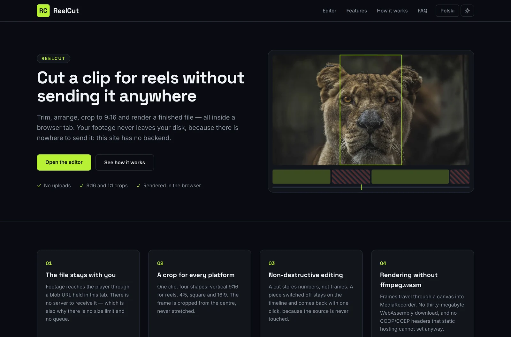
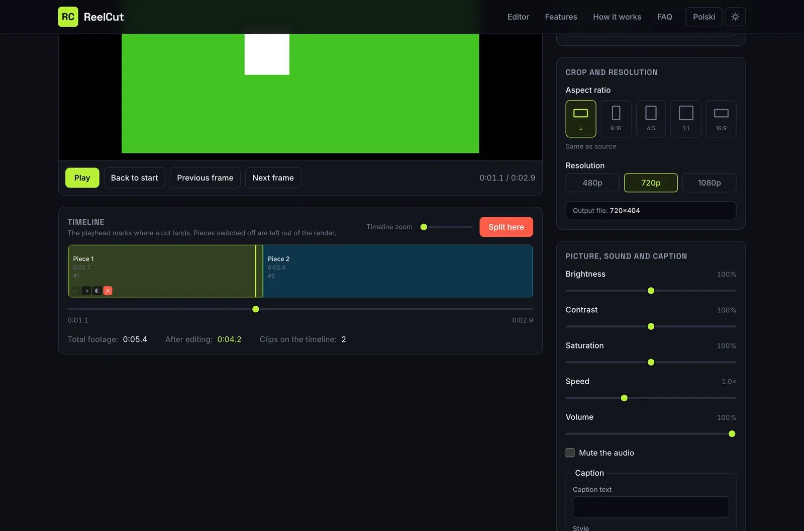
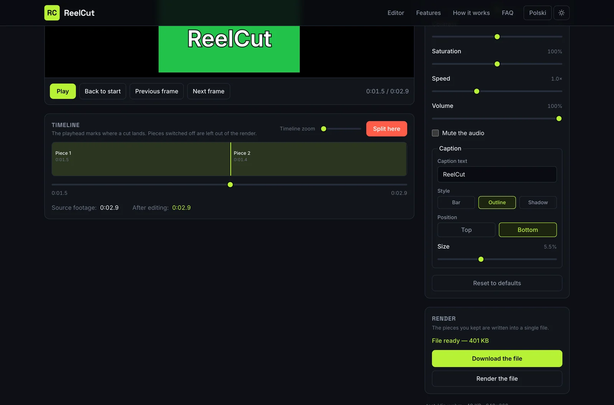
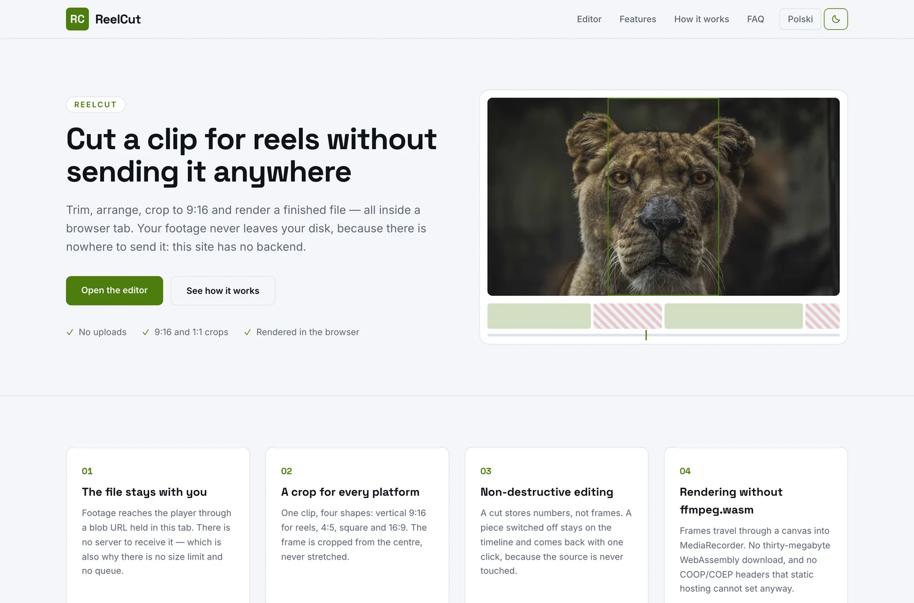

# ReelCut

> ✂️ **The footage never leaves the tab** — trim, crop to 9:16 and render a reel without uploading it anywhere

**ReelCut** is a video editor that runs inside a browser tab. Load a clip from disk, split it on the timeline, switch off the parts you do not want, crop it to the shape the platform wants, correct picture and sound, and render a finished file you can download straight away.

Nothing is uploaded and nothing is stored. The site is prerendered to files and served by GitHub Pages; the footage reaches the player through a blob URL that exists only in your tab.

[](https://github.com/dawidolko/ReelCut-Platform/actions/workflows/deploy.yml)


**Live:** [reelcut.dawidolko.pl](https://reelcut.dawidolko.pl) · **Polski:** [reelcut.dawidolko.pl/pl](https://reelcut.dawidolko.pl/pl/)

---

## 🎯 Key Features

- **Nothing is uploaded** — the clip is attached through a blob URL held in the tab. There is no server to receive it, which is also why there is no size limit and no queue.
- **Non-destructive cutting** — a split stores numbers, not frames. A piece switched off stays on the timeline and comes back with one click.
- **A render that actually produces a file** — frames go through a canvas into `MediaRecorder` and come out as a downloadable WebM, audio included.
- **A crop for every platform** — vertical 9:16 for reels and shorts, 4:5, square or wide, at 480p, 720p or 1080p. The frame is cropped from the centre, never stretched, and the preview is framed to the exact shape the render produces.
- **Picture and sound correction** — brightness, contrast, saturation, playback speed, volume and a caption in three styles (bar, outline, shadow) at the top or bottom of the frame, all previewed live.
- **Light and dark themes** — dark by default, because footage is judged against dark surroundings; applied before the first paint so the page never flashes the wrong one.
- **A zoomable timeline** — widen the rail to trim precisely on a long clip, and reorder pieces from the keyboard.
- **Keyboard transport** — space plays and pauses, arrows step one frame, and the shortcuts stand down while focus is in a text field.
- **Bilingual** — English at `/`, Polish at `/pl/`, with matching `hreflang` pairs and separate JSON-LD.

---

## 🖼️ Screenshots

| The premise in one screen                                       | The same, in dark                                                  |
| --------------------------------------------------------------- | -------------------------------------------------------------------- |
|  |  |

| The editor: 9:16 crop, timeline and caption styles                       | A finished render ready to download                            |
| -------------------------------------------------------------------------- | ----------------------------------------------------------------- |
|  |  |

| The same page in the light theme                                     |
| ---------------------------------------------------------------------- |
|  |

---

## 🎬 How the Render Works

The interesting constraint is that GitHub Pages cannot set response headers. That rules out the threaded build of **ffmpeg.wasm**, which requires `Cross-Origin-Opener-Policy` and `Cross-Origin-Embedder-Policy` for `SharedArrayBuffer`. Rather than ship a thirty-megabyte single-threaded fallback, ReelCut renders with what the browser already has:

1. A `<canvas>` is sized to the source video and captured with `canvas.captureStream(30)`.
2. The audio track is taken from the player's own stream — `captureStream()` in Chrome, `mozCaptureStream()` in Firefox — and added to the recording.
3. `MediaRecorder` starts, and the render walks the kept pieces in order: seek, play, and draw each frame with `ctx.filter` carrying the same correction string the preview uses. When a crop is selected, `drawImage` takes a centre rectangle from the source rather than scaling it, so nothing is stretched.
4. On the last piece the recorder stops and the chunks become a `Blob`.

**The honest trade-off:** the frames genuinely have to pass through the player, so rendering runs in real time — a minute of footage takes about a minute. The interface says so before you start, rather than leaving you guessing at a stalled progress bar.

Output is WebM with VP9 or VP8, whichever the browser reports it can record.

---

## 🧩 Application Layer

| Layer                            | Responsibility                                                                                     |
| -------------------------------- | ---------------------------------------------------------------------------------------------------- |
| `src/app`                        | Routing, per-language metadata, fonts, JSON-LD. Two prerendered routes: `/` and `/pl/`.               |
| `src/components/Editor.tsx`      | The session: the blob URL, timeline state, corrections, keyboard transport and the render lifecycle.   |
| `src/components/Timeline.tsx`    | The timeline. Pieces are drawn proportional to their length; the playhead marks where a split lands.   |
| `src/components/FormatPanel.tsx` | Aspect ratio and resolution, with swatches drawn to the real shape.                                    |
| `src/components/AdjustPanel.tsx` | Sliders and the caption, each announcing a human-readable value.                                       |
| `src/components/render.ts`       | The render pipeline — canvas, centre crop, `captureStream`, `MediaRecorder`, cancellation.             |
| `src/components/project.ts`      | Types and the maths: splitting, enabled pieces, edited length, output size and crop rectangle.         |
| `src/components/ThemeToggle.tsx` | The light/dark switch and the script that applies the theme before the first paint.                    |
| `src/components/content.ts`      | Every string in both languages.                                                                        |
| `src/app/globals.css`            | Design tokens and the timeline slider skin.                                                           |

---

## 🛠️ Technology Stack

### Frontend

| Technology       | Version | Role                                                                       |
| ---------------- | ------- | -------------------------------------------------------------------------- |
| **Next.js**      | 16      | App Router with `output: 'export'` — the whole site is prerendered to files. |
| **React**        | 19      | Component model; the editor owns the session state.                         |
| **TypeScript**   | 5       | Strict mode across the timeline maths and the render pipeline.               |
| **Tailwind CSS** | 4       | CSS-first configuration; design tokens declared in `@theme`.                 |

### Browser APIs

| API                     | Role                                                            |
| ----------------------- | --------------------------------------------------------------- |
| **`URL.createObjectURL`** | Attaches the local file to the player without an upload.        |
| **`canvas.captureStream`** | Turns the drawn frames into a recordable video track.          |
| **`MediaRecorder`**       | Encodes the stream into a WebM file, in the browser.            |
| **`HTMLVideoElement.captureStream`** | Supplies the audio track that goes with the picture. |

---

## 🚀 Getting Started

### Prerequisites

- Node.js 20 or newer
- npm

### 1. Clone the repository

```bash
git clone https://github.com/dawidolko/ReelCut-Platform.git
cd ReelCut-Platform
```

### 2. Install dependencies

```bash
npm install
```

### 3. Run

```bash
npm run dev        # development server at http://localhost:3000
npm run build      # static export into out/
npm run serve      # serve the built export locally
npm run typecheck  # TypeScript, no emit
npm run verify     # typecheck + build, the same pair the CI runs
```

---

## 🎨 Design

A cutting room, not a document: a cold near-black base (`#0a0c11`) because footage is judged against dark surroundings, electric lime (`#b8f135`) for anything that acts, and a warm red (`#ff5c47`) reserved strictly for cuts and removal. Display type is **Space Grotesk**, body text is **Inter**.

Both themes are declared as tokens, so components never hard-code a colour. The video stage is the deliberate exception — it stays black in either theme, because that is the only honest background for grading a picture.

---

## ♿ Accessibility

- Every slider carries `aria-valuetext`, so a screen reader announces “140%” rather than “1.4”.
- Timeline pieces are buttons with `aria-pressed`; switching one off is a labelled action, not a drag-only gesture.
- Rendering reports through `role="progressbar"` with a label and live values; errors are announced with `role="alert"`.
- Keyboard shortcuts stand down while focus is inside an input, so a space can still be typed into the caption.
- A skip link, a visible focus ring on every interactive element and a `prefers-reduced-motion` block that disables animation.

---

## 📁 Project Structure

```
ReelCut-Platform/
├── .github/workflows/deploy.yml   # typecheck, build, export assertion, publish
├── docs/screenshots/              # images used by this README
├── public/                        # favicon and CNAME
└── src/
    ├── app/
    │   ├── globals.css            # tokens and the timeline slider skin
    │   ├── (en)/                  # English at /
    │   └── (pl)/pl/               # Polish at /pl/
    └── components/
        ├── Editor.tsx             # session state, transport, render lifecycle
        ├── Timeline.tsx           # the zoomable timeline
        ├── FormatPanel.tsx        # aspect ratio and resolution
        ├── AdjustPanel.tsx        # picture, sound and caption controls
        ├── ThemeToggle.tsx        # light/dark switch
        ├── render.ts              # canvas → MediaRecorder render pipeline
        ├── project.ts             # types, timeline maths, crop geometry
        └── content.ts             # all copy, PL and EN
```

---

## 📄 License

MIT © [Dawid Olko](https://dawidolko.pl)
